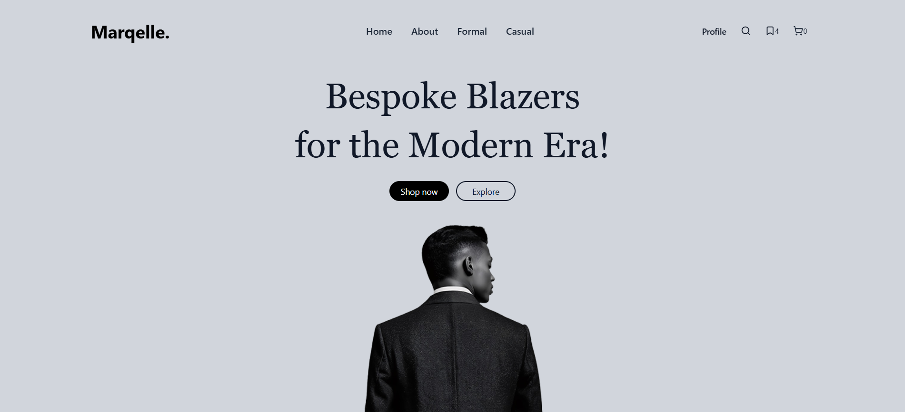
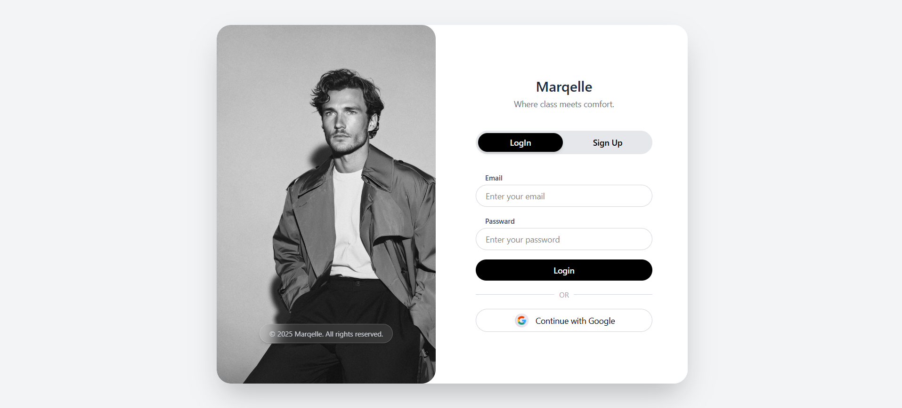
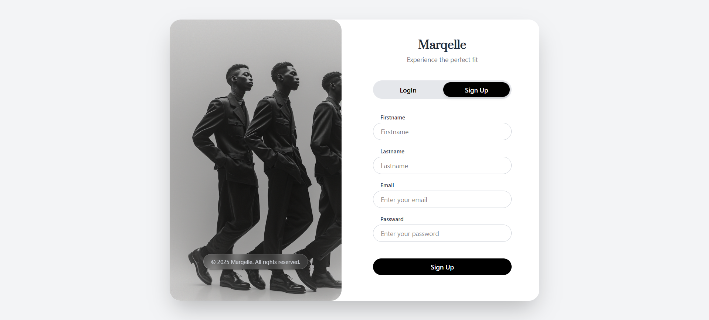
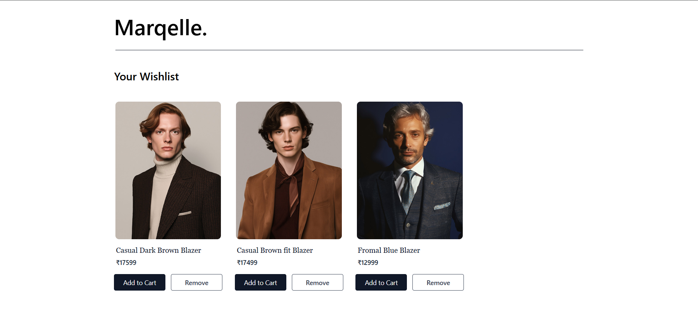
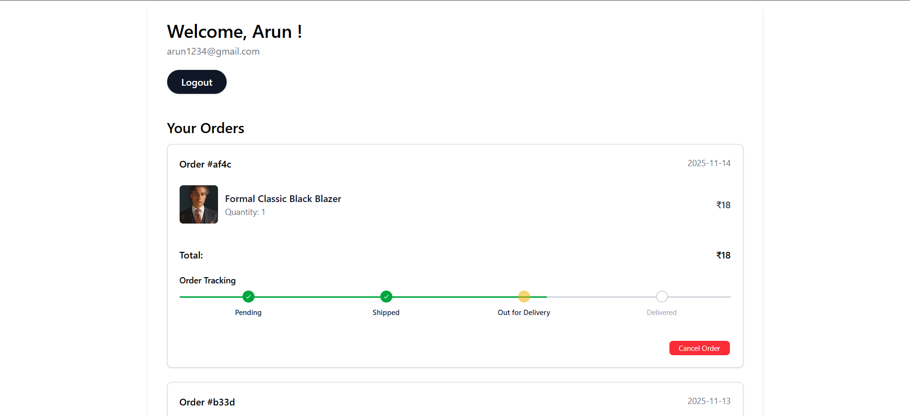
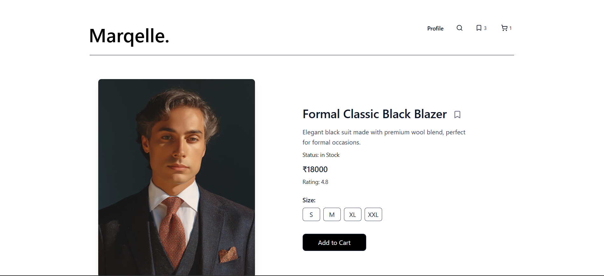
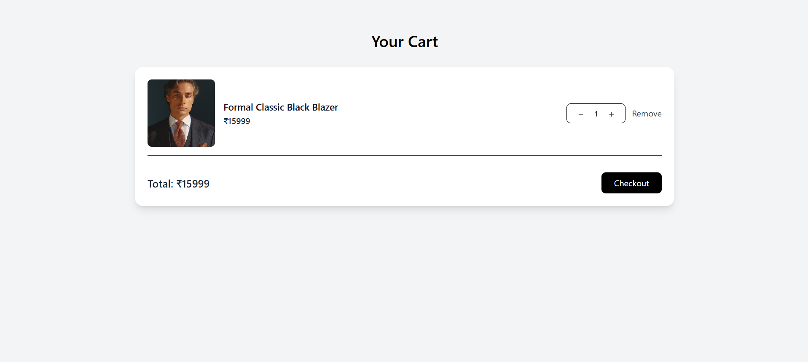
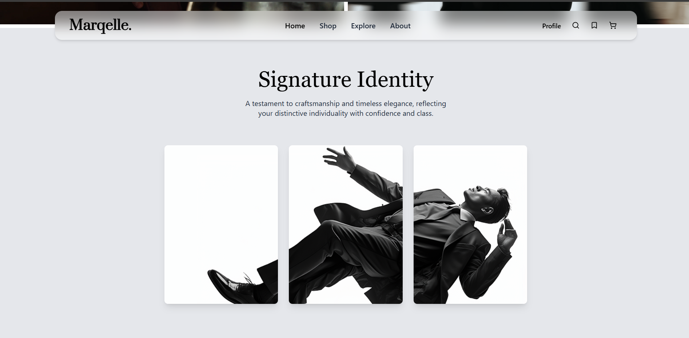
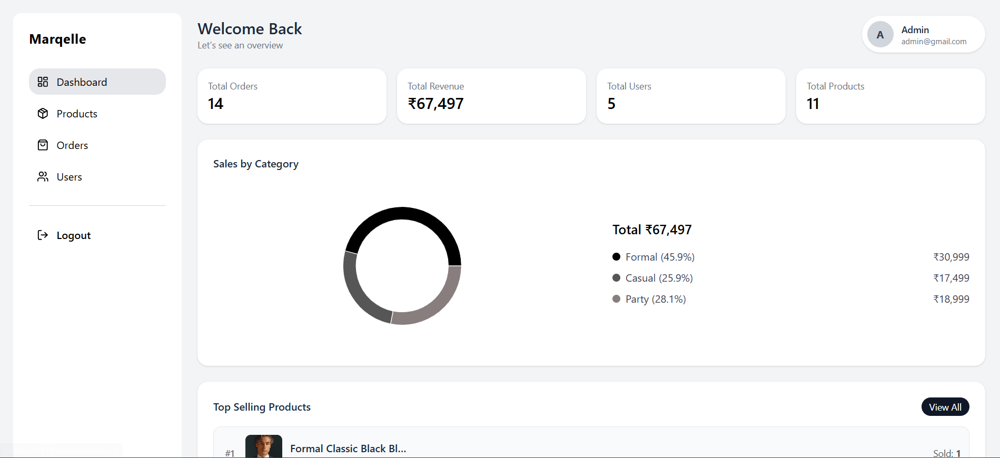

# Marqelle - E-Commerce Frontend 

This is the official React frontend for the **Marqelle** E-Commerce platform. It features a modern, responsive, and luxury-inspired user interface tailored for both customers and administrators.

**[Looking for the Backend API Repository? Click Here](https://github.com/arunjosf/Marqelle.-NET-Ecommerce-Project)** 

## Live Demo
The frontend is deployed and running live on Vercel: [Visit GD1 Platform](https://marqelle-ecommerce.vercel.app/home)

## Tech Stack
* **Framework:** React.js (Vite)
* **Styling:** Tailwind CSS
* **Animations:** Framer Motion
* **Routing:** React Router DOM
* **State Management:** React Context API
* **API Requests:** Axios
* **Notifications:** React Hot Toast
* **Icons:** Lucide React

## Features
* **Authentication:** Secure Login and Signup flows with Email OTP Verification and automatic JWT refresh handling.
* **Customer Experience:** 
  * Beautiful landing pages with smooth scroll animations.
  * Product browsing, filtering, and dynamic search.
  * Real-time Cart and Wishlist management.
  * Secure checkout and payment processing via Razorpay.
  * User profile dashboard for tracking order history.
* **Admin Dashboard:** 
  * Secure, role-protected admin routes.
  * Manage products, view customer analytics, and fulfill orders.
* **Responsive Design:** A mobile-first approach ensuring the app looks stunning on phones, tablets, and desktop displays.

## Screenshots
Here is a visual overview of the application in action:












## Local Development Setup

### 1. Prerequisites
* [Node.js](https://nodejs.org/) (v16 or higher)
* Git

### 2. Clone the Repository
```bash
git clone https://github.com/arunjosf/Marqelle-Project-Front-end-React
cd Marqelle-Project-Front-end-React
```
